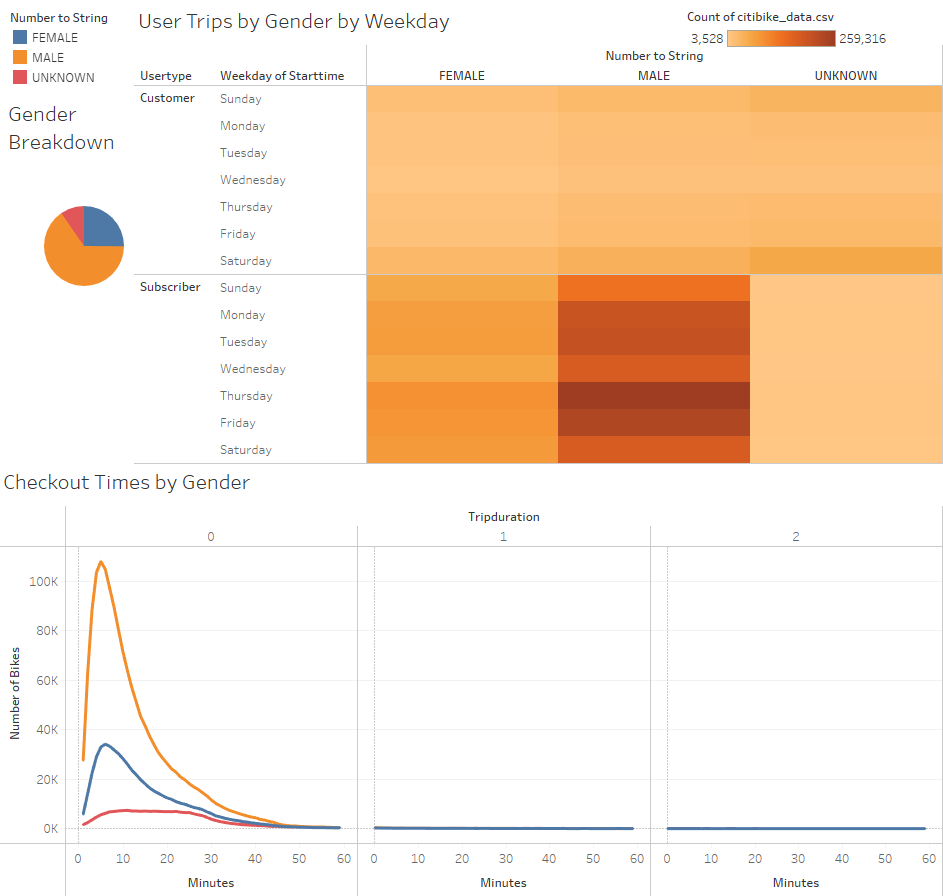

# CitiBike Tableau Challenge

## Overview
This is an analysis looking at CitiBike usage in New York City for the month of August. By breaking down the usage in a big city like New York, we are aiming to see what it can tell us about potentially running a similar service in Des Moines. This is an analysis to demonstrate we understand the task we are undertaking, and we understand what components to apply and what steps to take when moving forward with our own business.

[link to dashboard](https://public.tableau.com/app/profile/rose8042/viz/citibike_challenge_16627864254690/BikeUsage?publish=yes)

## Results
A large portion of the data we have is looking at bike usage by gender, so that comprises a majority of this analysis as well. 

For starters, simply looking at the data it is impossible to miss the extent to which men account for the data we have. When we look at checkout times for users versus the checkout times by gender, they look nearly identical. That the overall users almost reaches 150k on the top chart, while on the bottom chart the male users are just over 100k is easy to miss at a glance.

However, even if men are the majority when it comes to using this service, it does not mean everything else can be ignored. Women account for 34k at about the same spot. Unknown genders, which may include some men and women, never counts over 10k. This is still a large amount of rides, and as such it is valuable data.

Above, we have the gender breakdown, the same checkout times by gender chart, and also the user trips by gender by weekday chart.

- The gender breakdown confirms men account for the majority of people using CitiBike.

- The checkout times by gender tells us that yes, it is mostly men using the bikes, but also tells us most of their rides are about five minutes, while women's are mostly six minutes. The trend is the same. Unknown genders lacks this trend, but it does dip down around the thirty minute mark, which also occurs with both men and women. We can conclude that under ten minutes is the most common trip duration for August.

- The trips by gender by weekday chart is similar to the checkout times by gender in that the male and female trends mirror each other. For male and female subcribers, Monday, Tuesday, Thursday, and Friday have the most bikes used. Meanwhile, unknown genders are used most on the weekenders, and these are customers, not subscribers. We can also see in this chart that not many unknown genders are subscribers.

Now, we have the trips by weekday by hour and the weekday by hour when broken down by gender.
 - The overall trips by weekday shows us that 8am, 5pm, and 6pm are the most popular times. In other words, when people are going to and leaving from work, and this is consistent through the work week. On the weekend things start picking up at about 8am or 9am, and then steadily grows until about 5pm or 6pm, where it begins to taper off. There is also more usage in the midday on Thursday and Friday compared to earlier in the week.
 
 - When this chart is broken down by gender, we see the overall pattern replicated across the three categories we have. This tells us that men, women, and other tend to have the same bike usage habits, which is important to know.

Finally, we have the top starting and ending locations, and I have provided the gender breakdown for emphasis.
- We can see that in several locations the starting and ending locations are the same. This tracks when considering that a large portion of users are using the bikes to commute to and from work.

- The majority of the data is from Manhattan, but there is still plenty of
usage in the other buroughs. It might be reasonable to suggest tourists boost the number in the lower parts of Manhattan quite a bit.

- Again, knowing that the userbase is overwhelmingly male, we know men skew these results to favor them. However, we also know from the previous charts that their trends are likely to be echoed with both women and unknown genders. So, even without a breakdown these charts should be reliable.

## Summary
Looking at this data, we can say for certain that we have a potential userbase in those working 9 to 5 jobs, and likely other jobs as well. This is supported by the duration of the rides as well. Most people are likely biking to their jobs that aren't very far from their homes, not going out for a leisurely ride around the block.

In a big city, where many may not drive, transportation options are invaluable. Public transportation is not always an option, and is sometimes too much of a hassle. There will always be locals open to relying on a service offering an opportunity to make their lives easier.

For visualizations I would like to see with this dataset, I would like to see the starting and ending locations by gender. We should confirm that the pattern will repeat again, not just assume it. A breakdown of the starting and ending locations by customer type would also be useful. Not every customer is going to be a tourist, but we should see if there are any patterns to be picked up on when looking at them versus subscribers, especially since the dataset we are working from is New York City.
